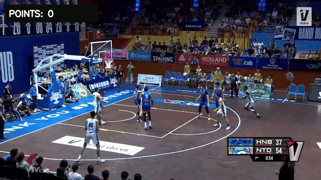

# CourtVision

CourtVision is a basketball computer-vision project that trains a YOLOv8 detector for `ball` and `net`, runs inference on game footage, and counts made baskets when the ball moves from above the rim to below it. The repo is organized as an end-to-end portfolio project: dataset audit, Colab training workflow, model artifact, made-basket counter script, sample media, and tests for the basket-counting logic.

## Demo



[Watch the higher-quality MP4 demo](docs/demo/courtvision-point-counter.mp4)

The current demo run detects one confirmed made-basket event at frame `9032` / `301.067s` and renders a persistent `MADE BASKETS: 1` overlay plus a `MADE BASKET` banner. This is the primary recruiter-facing demo because it shows the core feature directly instead of requiring someone to scrub through the full game video.

The original videos are stored with Git LFS and may not preview directly in GitHub:

- [Sample input video](sample.mp4)
- [Full annotated output video](output.mp4)

## Highlights

- YOLOv8 object detection for `ball` and `net` classes
- Made-basket counter using an above-rim to below-rim trajectory check
- Optional near-rim event recorder for shot-attempt analysis
- Separate confidence thresholds for the small ball and larger net
- Persistent video HUD with running made-basket count and confirmation banner
- CSV/JSON event exports plus per-frame metrics for review/debugging
- DeepSORT-based tracking experiments for video analysis
- Included dataset split with YOLO label files
- Notebook workflow for training, validation, and sample video inference
- Git LFS configured for large `.mp4` and `.pt` assets

## Repository Structure

```text
courtvision/
  data.yaml       YOLO dataset configuration
  docs/demo/      README demo GIF, preview image, and short MP4
  scripts/        Dataset audit, training, and crossing detection scripts
  notebooks/      Colab-ready GPU workflow
  test.ipynb      Training, validation, and tracking notebook
  train/          Training images and labels
  valid/          Validation images and labels
  test/           Test images and labels
  models/         Trained CourtVision detector weights, stored with Git LFS
  sample.mp4      Sample input video, stored with Git LFS
  output.mp4      Example output video, stored with Git LFS
  yolov8x.pt      Model artifact, stored with Git LFS
```

## Setup

```bash
git lfs install
git clone https://github.com/nguyenthevietquang07/courtvision.git
cd courtvision

python -m venv venv
venv\Scripts\activate
pip install -r requirements.txt
jupyter notebook
```

On macOS/Linux, activate the virtual environment with `source venv/bin/activate`.

If Ultralytics cannot write to the default user config directory on Windows, point it at the repo-local config folder:

```powershell
$env:YOLO_CONFIG_DIR=".yolo_config"
```

## Usage

### 1. Audit the labels

```bash
python scripts/audit_dataset.py
```

Expected class names:

- `0`: ball
- `1`: net

### 2. Train a custom detector

Local CPU training is possible but slow. For the best result, open `notebooks/colab_train_and_crossings.ipynb` in Google Colab with a GPU runtime.

```bash
python scripts/train_ball_net.py --model yolov8s.pt --epochs 80 --batch 16 --imgsz 640
```

The trained model is saved at:

```text
courtvision_runs/courtvision_ball_net/weights/best.pt
```

### 3. Count made baskets

```bash
python scripts/detect_crossings.py \
  --weights models/courtvision_ball_net_best.pt \
  --source sample.mp4 \
  --out-dir runs/crossings \
  --event-mode made-basket \
  --conf 0.10 \
  --ball-conf 0.15 \
  --net-conf 0.25 \
  --save-video
```

Outputs:

- `runs/crossings/crossing_events.csv` - one row per crossing event
- `runs/crossings/crossing_events.json` - structured event output
- `runs/crossings/frame_metrics.csv` - per-frame ball/net IoU and center metrics
- `runs/crossings/annotated_crossings.mp4` - optional annotated video

In the default `made-basket` mode, the counter first observes the ball above and horizontally aligned with the rim, then confirms a made basket only when a later detection moves below the rim within `--transition-frames`. A cooldown prevents one basket from being counted more than once. The sample demo output contains:

```csv
event_id,frame,time_seconds,ball_confidence,net_confidence,trigger
1,9032,301.067,0.2204,0.7798,above_to_below_rim
```

The annotated video always displays the running made-basket total. Ball and net confidence thresholds are configured separately because the small, fast-moving ball commonly has a lower confidence than the larger net.

For exploratory shot-attempt analysis, use `--event-mode near-rim`. That looser mode records overlap, padded-net containment, or center proximity. Near-rim events are not equivalent to made baskets.

## Dataset

The dataset uses YOLO format with two classes:

- `0`: ball
- `1`: net

`data.yaml` uses repo-relative paths so it can run locally or in hosted notebook environments after the repository is mounted.

## Notes for Reviewers

- Large media/model files are intentionally tracked with Git LFS via `.gitattributes`.
- The notebook was originally developed in Google Colab; local runs may need small path changes for notebook-only cells that reference `/content/...`.
- GPU acceleration is recommended for training.
- The current detector is strong enough to demonstrate the made-basket counting pipeline, but small/occluded basketball detections are still the main model-quality bottleneck. More rim-area labels and additional made/missed basket clips would be the next step toward production-level accuracy.

## Quality Checks

```bash
python -m unittest discover -s test
python scripts/audit_dataset.py
```

The automated tests cover the basket-counter state machine, duplicate-count cooldown, transition window behavior, rim alignment guard, and class-specific confidence filtering.
